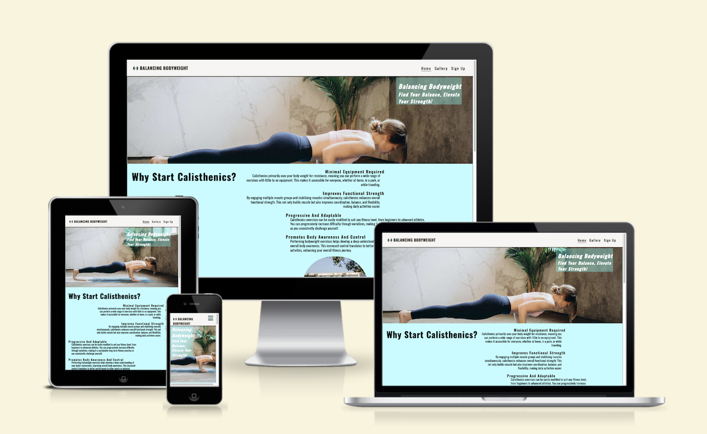
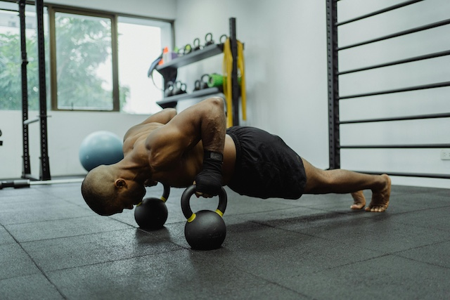

# Balancing Bodyweight

## Introduction

The website "Balancing Bodyweight" focuses on calisthenics, a form of exercise that utilizes body weight for resistance training. It aims to promote fitness for all levels, from beginners to advanced athletes. Our mission is to provide accessible and adaptable workout options that help users improve their strength, coordination, and body awareness.  
Overall, the site encourages users to find their balance and elevate their strength through bodyweight training.

## Features

### Exisiting Features

  -__Navigation Bar__

- Simple navigation, clear categories, and a responsive design for mobile users.  

- This is featured across all three pages with links to the Logo, Home, Gallery and Sign Up page making it fully responsive and easy to navigate on site across pages within window and not push the back button to get to previous page.

  -__The landing page image__

- The introduction image and fiting text to go with the theme of the web application.
  
)

- __Benefits section__

- __Minimal Equipment Required__: Perform exercises anywhere with little to no equipment.  
- __Functional Strength Improvement__: Engage multiple muscle groups to enhance everyday strength and flexibility.  
- __Progressive and Adaptable__: Modify exercises to suit your fitness level and progressively challenge yourself.  
- __Levels of Training__: Explore structured workouts for various levels (Beginner, Intermediate, Advanced, Elite, Master).  

)

- __Difficulty Level__
- __Levels of Calisthenics__
  - __Beginner:__ Basic exercises, and tips.
  - __Intermediate:__ More complex movements.
  - __Advanced:__ High-level skills.
  - __Elite:__ Master challenging movements and advanced techniques.
  - __Master:__ Achieving pick performance and creating own movement combinations .

)

- __The Footer__

  - The footer section includes links to the relevant social media sites. The links will open to a new tab to allow easy navigation for the user.
  - The footer is valuable to the user as it encourages them to keep connected via social media

)

- __Gallery__

  Visual representation of what calisthenics workouts could look like .  

)

- __The Sign Up Page__

- The sign up page allows for users to sign up to gain more information on making one self-sufficient in structuring your own workout plans. this can be set byt being able to specify preferences on what calisthenics level the user is at respectively.  

)

- __Thank You page__

- The thank you page is a hidden page that has been included to simulate the response from a server when user fills in sign up form. It was done this way as i dont have access to a server to submit the form to.
- Provides the user with an improved user experience through confirmation that their message has been recieved.

### Features Left to Implement

- Add-on to sign up form, making it to capture more user details in for optimal user experience.

## HTML Structure  

The website is structured using HTML5 semantics with sections dedicated to navigation, main content, and footer.  

### Key HTML Elements  

- __Header__: Contains the logo and navigation links.  
- __Main__:  
  - Hero section with a title and subtitle.  
  - Reasons to start calisthenics highlighting various benefits and physical advantages.  
  - Different skill levels providing workout examples and goals.  
- __Footer__: Social media links and copyright notice.  

## Testing
### HTML and CSS validation
[validator results for index.html](https://validator.w3.org/nu/?doc=https%3A%2F%2Fbraunie999.github.io%2FBalancingBodyweight%2F)

## Usage  

To view the website:  

1. Clone the repository.  
2. Open (<https://braunie999.github.io/BalancingBodyweight/>) in your web browser.  
3. Explore the various sections and gain insights into bodyweight training.  

## Technologies Used  

- HTML5  
- CSS (linked externally)  
- Font Awesome for icons  

## Author  

© 2024 Kiara Braun  

## Contact  

For inquiries or feedback, please reach out via [GitHub](https://github.com/braunie999).  
