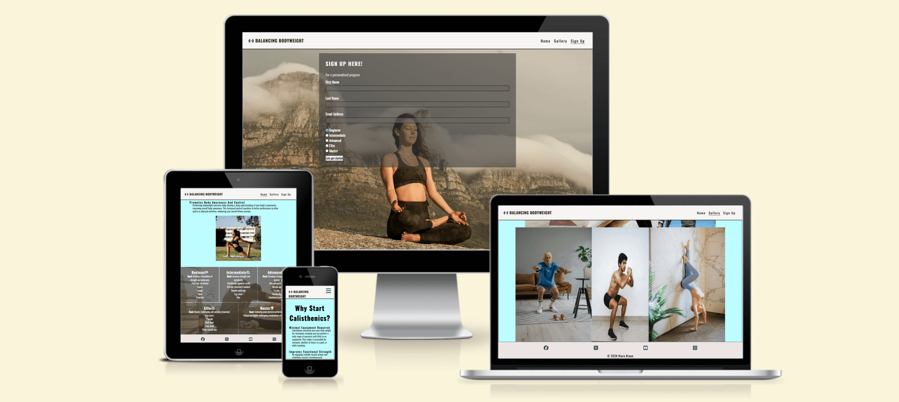
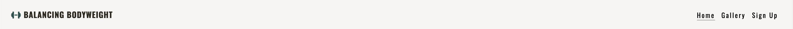
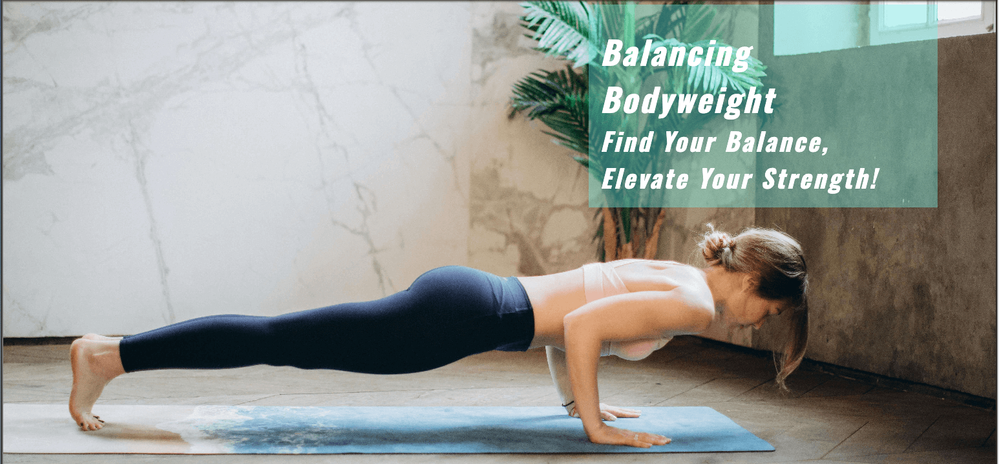
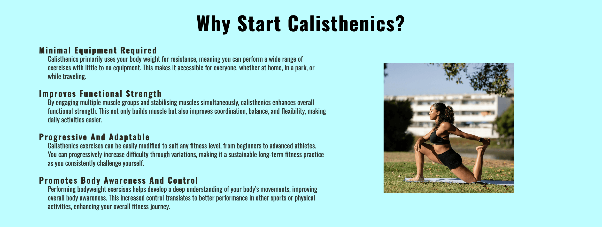
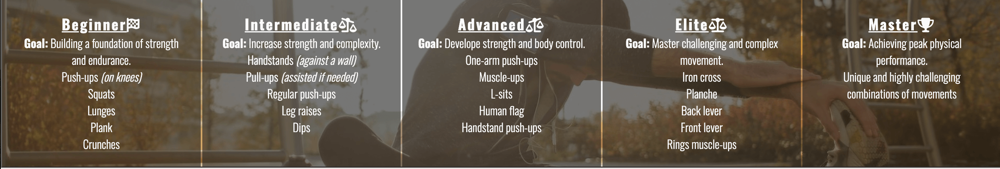
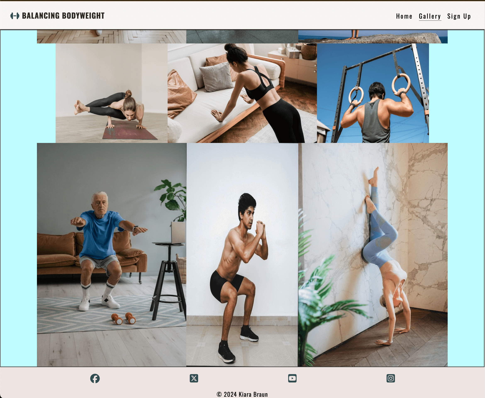
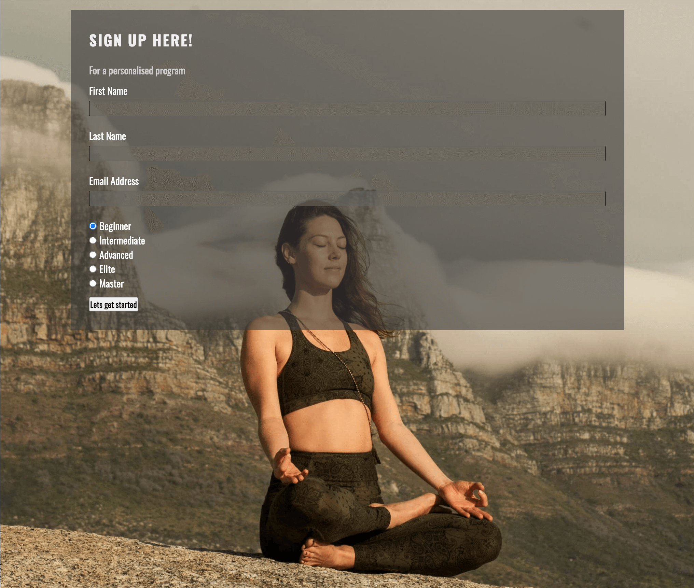
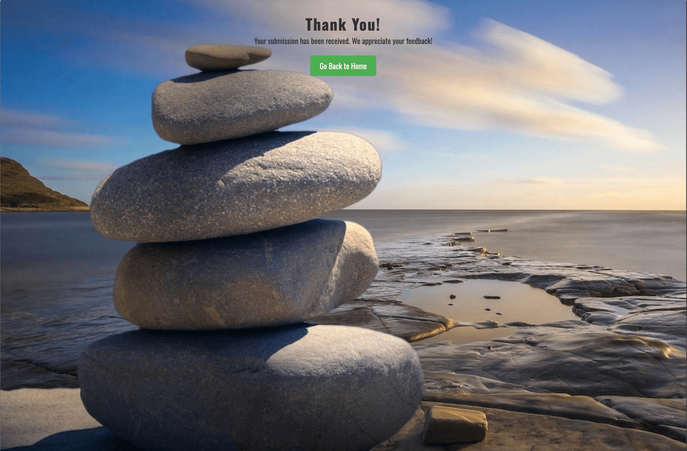

# Balancing Bodyweight

## Introduction

The website "Balancing Bodyweight" focuses on calisthenics, a form of exercise that utilizes body weight for resistance training. It aims to promote fitness for all levels, from beginners to advanced athletes. Our mission is to provide accessible and adaptable workout options that help users improve their strength, coordination, and body awareness.  
Overall, the site encourages users to find their balance and elevate their strength through bodyweight training.

## Features

### Exisiting Features

- **Navigation Bar**

- Simple navigation, clear categories, and a responsive design for mobile users.

- This is featured across all three pages with links to the Logo, Home, Gallery and Sign Up page making it fully responsive and easy to navigate on site across pages within window and not push the back button to get to previous page.

- **The landing page image**

- The introduction image and fiting text to go with the theme of the web application.

- **Benefits section**

- **Minimal Equipment Required**: Perform exercises anywhere with little to no equipment.
- **Functional Strength Improvement**: Engage multiple muscle groups to enhance everyday strength and flexibility.
- **Progressive and Adaptable**: Modify exercises to suit your fitness level and progressively challenge yourself.
- **Levels of Training**: Explore structured workouts for various levels (Beginner, Intermediate, Advanced, Elite, Master).

- **Levels of Calisthenics**

  - **Beginner:** Basic exercises, and tips.
  - **Intermediate:** More complex movements.
  - **Advanced:** High-level skills.
  - **Elite:** Master challenging movements and advanced techniques.
  - **Master:** Achieving pick performance and creating own movement combinations .

- **The Footer**

  - The footer section includes links to the relevant social media sites. The links will open to a new tab to allow easy navigation for the user.
  - The footer is valuable to the user as it encourages them to keep connected via social media

- **Gallery**

  Visual representation of what calisthenics workouts could look like .

- **The Sign Up Page**

- The sign up page allows user to gain more personalised imformation on selected/ prefered level of difficulty. Thus promoting body movement and a healthier lifestyle.

- **Thank You page**

- The thank you page is a hidden page that has been included to simulate the response from a server when user fills in sign up form. It was done this way as i dont have access to a server to submit the form to.
- Provides the user with an improved user experience through confirmation that their message has been recieved.

### Features Left to Implement

- Add-on to sign up form, making it to capture more user details in for optimal user experience.

## HTML Structure

The website is structured using HTML5 semantics with sections dedicated to navigation, main content, and footer.

### Key HTML Elements

- **Header**: Contains the logo and navigation links.
- **Main**:
  - Hero section with a title and subtitle.
  - Reasons to start calisthenics highlighting various benefits and physical advantages.
  - Different skill levels providing workout examples and goals.
- **Footer**: Social media links and copyright notice.

## Validator Testing

### HTML

[validator results for index.html](https://validator.w3.org/nu/?doc=https%3A%2F%2Fbraunie999.github.io%2FBalancingBodyweight%2F)

[validator results for gallery.html](https://validator.w3.org/nu/?doc=https%3A%2F%2Fbraunie999.github.io%2FBalancingBodyweight%2Fgallery.html)

[validator results for signup.html](https://validator.w3.org/nu/?doc=https%3A%2F%2Fbraunie999.github.io%2FBalancingBodyweight%2Fsignup.html)

[validator results for thankyou.html](https://validator.w3.org/nu/?doc=https%3A%2F%2Fbraunie999.github.io%2FBalancingBodyweight%2Fthankyou.html)

### CSS

## Usage

To view the website:

1. Clone the repository.
2. Open (<https://braunie999.github.io/BalancingBodyweight/>) in your web browser.
3. Explore the various sections and gain insights into bodyweight training.

## Technologies Used

- HTML5
- CSS (linked externally)
- Font Awesome for icons

## Author

© 2024 Kiara Braun

## Contact

For inquiries or feedback, please reach out via [GitHub](https://github.com/braunie999).
